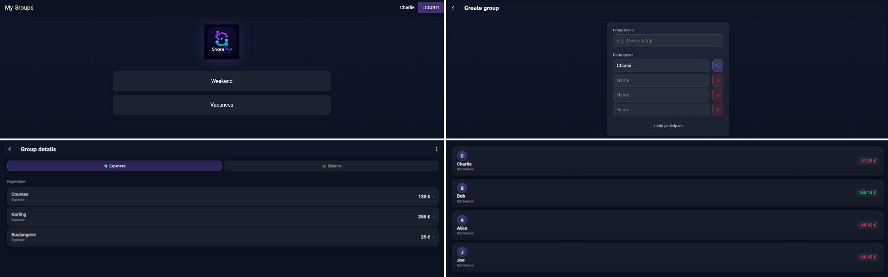
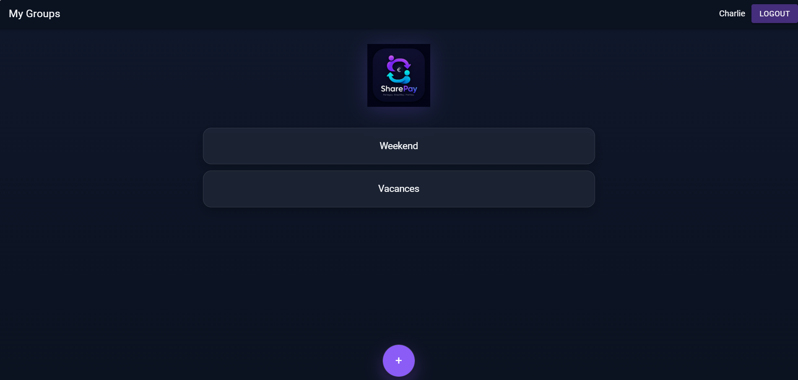
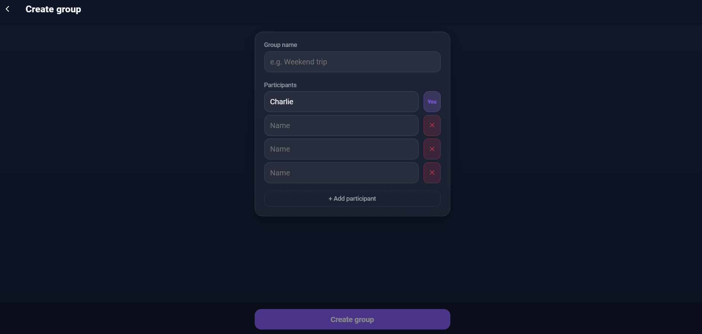
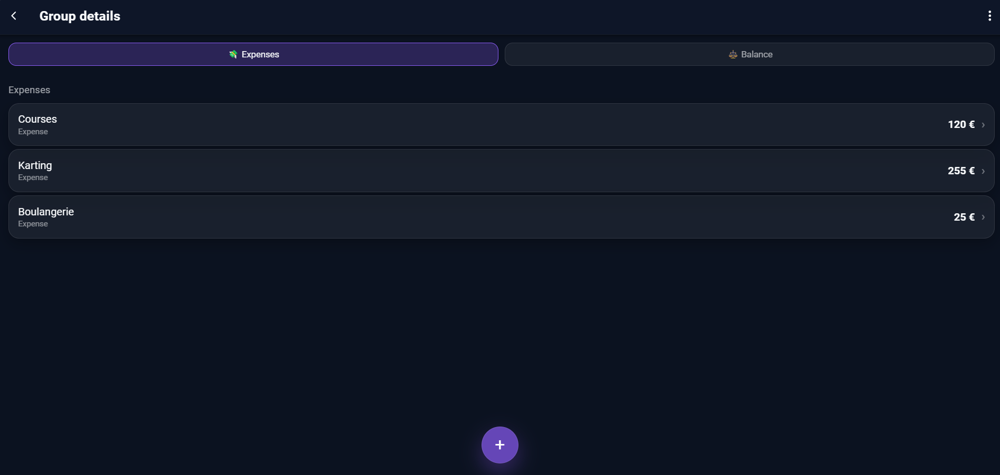
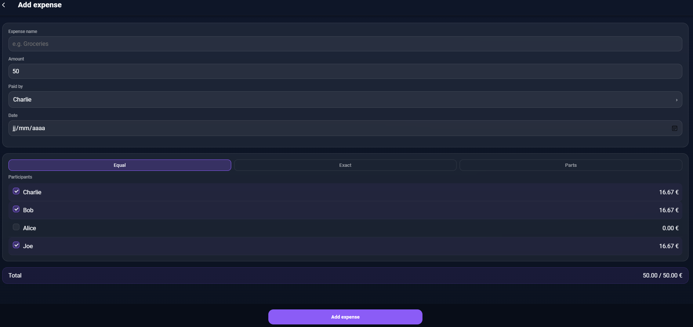
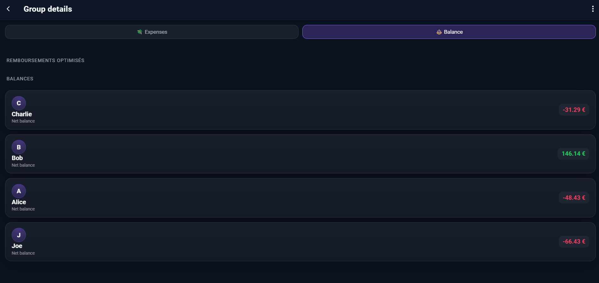

# 💸 SharePay

Application web permettant de gérer simplement des dépenses partagées entre plusieurs personnes.

L'objectif est de faciliter le suivi des dépenses lors de voyages, colocations ou événements entre amis, en calculant automatiquement les soldes et les remboursements nécessaires.



---

## ✨ Fonctionnalités

### 👤 Gestion des utilisateurs
- Création de compte
- Authentification sécurisée avec JWT
- Gestion du profil utilisateur

### 👥 Gestion des groupes
- Création de groupes de dépenses
- Ajout de participants
- Système d'invitation par lien

### 💰 Gestion des dépenses
- Ajout de dépenses communes
- Choix du participant ayant payé
- Répartition équitable ou personnalisée
- Calcul automatique des dettes

### 📊 Balance automatique
- Visualisation des soldes entre participants
- Génération des remboursements optimisés

---

# 🖥️ Aperçu de l'application

## Tableau de bord



## Creation d'un groupe



## Détails d'un groupe




## Ajout d'une dépense




## Balance et remboursements



---

# 🛠️ Technologies utilisées

## Frontend
- Angular
- Ionic
- TypeScript
- SCSS

## Backend
- Node.js
- Express.js
- PostgreSQL
- JWT Authentication

## Outils
- Git / GitHub
- Postman
- VS Code

---

# 🏗️ Architecture

```
SharePay
│
├── frontend
│   ├── Angular
│   └── Ionic
│
├── backend
│   ├── Express API
│   ├── Routes
│   ├── Controllers
│   └── PostgreSQL
│
└── README.md
```

---

# 🚀 Installation

## Backend

```bash
cd backend
npm install
```

Créer un fichier `.env` :

```env
PORT=3000

DB_USER=postgres
DB_HOST=localhost
DB_NAME=share_pay
DB_PASSWORD=password
DB_PORT=5432

JWT_SECRET=my_secret
```

Lancer le serveur :

```bash
npm start
```

---

## Frontend

```bash
cd frontend
npm install
```

Lancer l'application :

```bash
ionic serve
```

---

# 📌 API

Quelques endpoints disponibles :

| Méthode | Route | Description |
|-|-|-|
| POST | /auth/login | Connexion utilisateur |
| POST | /users | Création utilisateur |
| GET | /groups | Récupération des groupes |
| POST | /groups/:id/expenses | Ajout d'une dépense |
| GET | /groups/:id/balance | Calcul des balances |

---

# 🎯 Objectifs du projet

Ce projet m'a permis de mettre en pratique :

- La conception d'une application full-stack
- La création d'une API REST
- La gestion d'une base relationnelle PostgreSQL
- L'authentification JWT
- Le développement d'une interface responsive
- La gestion d'un projet complet de bout en bout

---

# 👨‍💻 Auteur

Hugo Brisset

GitHub :
[https://github.com/...](https://github.com/hugobrisset)
